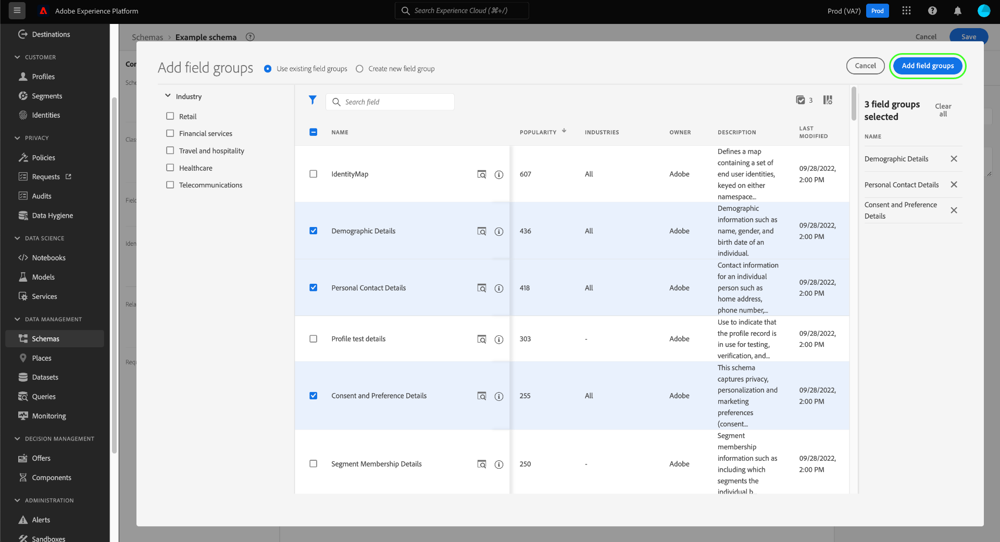
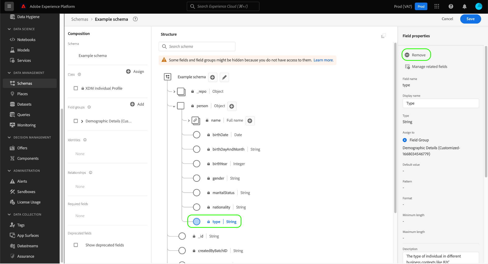

# 在UI中建立和編輯結構描述

本指南概述如何在Adobe Experience Platform UI中建立、編輯及管理貴組織的Experience Data Model (XDM)結構描述。

>[!IMPORTANT]
>
>XDM結構描述是完全可自訂的，因此建立結構描述的相關步驟可能會因您希望結構描述擷取的資料型別而異。 因此，本檔案僅涵蓋您可以在UI中使用結構描述進行的基本互動，並排除自訂類別、結構描述欄位群組、資料型別和欄位等相關步驟。
>
>如需結構描述建立流程的完整導覽，請隨附 [結構描述建立教學課程](../../tutorials/create-schema-ui.md) 以建立完整的範例結構描述，並熟悉 [!DNL Schema Editor].

## 先決條件

本指南需要實際瞭解XDM系統。 請參閱 [XDM概觀](../../home.md) 介紹XDM在Experience Platform生態系統內的角色，以及 [結構描述組合基本概念](../../schema/composition.md) 以取得結構描述建構方式的概觀。

## 建立新結構描述 {#create}

>[!NOTE]
>
>本節說明如何在UI中手動建立新結構描述。 如果您正在將CSV資料內嵌至平台，您可以選擇使用 [將該資料對應到AI產生的建議所建立的XDM結構描述](../../../ingestion/tutorials/map-csv/recommendations.md) （目前為測試版），不需自行手動建立結構描述。

在 [!UICONTROL 結構描述] 工作區，選取 **[!UICONTROL 建立結構描述]** 右上角。 在出現的下拉式清單中，您可以選擇 **[!UICONTROL XDM個別設定檔]** 和 **[!UICONTROL XDM ExperienceEvent]** 作為結構描述的基底類別。 或者，您可以選取 **[!UICONTROL 瀏覽]** 從完整的可用類別清單中選取，或 [建立新的自訂類別](./classes.md#create) 而非。

選取類別後， [!DNL Schema Editor] 隨即顯示，而結構描述的基本結構（由類別提供）會顯示在畫布中。 從這裡，您可以使用右邊欄新增 **[!UICONTROL 顯示名稱]** 和 **[!UICONTROL 說明]** 適用於此結構描述。

您現在可以透過以下方式開始建立結構描述的結構 [新增結構描述欄位群組](#add-field-groups).

## 編輯現有結構描述 {#edit}

>[!NOTE]
>
>一旦結構描述已儲存並用於資料擷取中，就只能對其執行加總變更。 請參閱 [結構描述演化規則](../../schema/composition.md#evolution) 以取得詳細資訊。

若要編輯現有綱要，請選取 **[!UICONTROL 瀏覽]** 索引標籤，然後選取您要編輯的結構描述名稱。

>[!TIP]
>
>您可以使用工作區的搜尋和篩選功能來協助您更輕鬆地尋找結構。 請參閱指南： [探索XDM資源](../explore.md) 以取得詳細資訊。

選取結構描述後， [!DNL Schema Editor] 會以畫布中所顯示的結構顯示。 您現在可以 [新增欄位群組](#add-field-groups) 至結構描述(或 [新增個別欄位](#add-individual-fields) 來自這些群組)， [編輯欄位顯示名稱](#display-names)，或 [編輯現有的自訂欄位群組](./field-groups.md#edit) 如果結構描述採用任何。

## 顯示名稱切換 {#display-name-toggle}

為方便起見，結構描述編輯器在原始欄位名稱與更易懂的顯示名稱之間提供切換選項。 此靈活性可改善欄位可發現性和結構描述的編輯。 此切換位於結構描述編輯器檢視的右上角。

>[!NOTE]
>
>從欄位名稱到顯示名稱的變更純粹是裝飾性的，不會改變任何下游資源。

![架構編輯器，具有 [!UICONTROL 顯示欄位的顯示名稱] 反白顯示。](../../images/ui/resources/schemas/display-name-toggle.png)

標準欄位群組的顯示名稱由系統產生，但可加以自訂，如 [顯示名稱](#display-names) 區段。 顯示名稱會反映在多個UI檢視中，包括對應和資料集預覽。 預設設定為關閉，且會依其原始值顯示欄位名稱。

## 將欄位群組新增至結構描述 {#add-field-groups}

>[!NOTE]
>
>本節說明如何將現有欄位群組新增至結構描述。 如果您想要建立新的自訂欄位群組，請參閱以下指南： [建立和編輯欄位群組](./field-groups.md#create) 而非。

當您在中開啟結構描述後 [!DNL Schema Editor]，您可使用欄位群組來新增欄位至結構描述。 若要開始，請選取 **[!UICONTROL 新增]** 旁邊 **[!UICONTROL 欄位群組]** 在左側邊欄中。

![結構描述編輯器，具有 [!UICONTROL 新增] 從 [!UICONTROL 欄位群組] 區段反白顯示。](../../images/ui/resources/schemas/add-field-group-button.png)

此時會出現一個對話方塊，顯示您可以為結構描述選取的欄位群組清單。 由於欄位群組僅與一個類別相容，因此只會列出與結構描述所選類別相關聯的欄位群組。 依預設，列出的欄位群組是根據其在您組織內的使用人氣排序。

如果您知道要新增欄位的一般活動或業務區域，請在左側邊欄中選取一或多個垂直產業類別，以篩選顯示的欄位群組清單。

>[!NOTE]
>
>如需XDM中特定產業資料模型化最佳實務的詳細資訊，請參閱以下檔案： [產業資料模型](../../schema/industries/overview.md).

您也可以使用搜尋列來協助尋找所需的欄位群組。 名稱與查詢相符的欄位群組會出現在清單頂端。 下 **[!UICONTROL 標準欄位]**，包含描述所需資料屬性之欄位的欄位群組隨即顯示。

選取您要新增至結構描述的欄位群組名稱旁的核取方塊。 您可以從清單中選取多個欄位群組，每個選取的欄位群組都會顯示在右側邊欄中。

>[!TIP]
>
>對於任何列出的欄位群組，您可以將滑鼠懸停在資訊圖示()以檢視欄位群組擷取的資料型別的簡短說明。 您也可以選取預覽圖示()，以檢視欄位群組提供的欄位結構，然後再決定將其新增至結構描述。

選擇欄位群組後，選取 **[!UICONTROL 新增欄位群組]** 以將其新增至結構描述。

此 [!DNL Schema Editor] 會以畫布中顯示的欄位群組提供的欄位重新出現。

將欄位群組新增到結構描述後，您可以選擇性地進行 [移除現有欄位](#remove-fields) 或 [新增自訂欄位](#add-fields) 根據您的需求，提供給這些群組。

### 移除從欄位群組新增的欄位 {#remove-fields}

將欄位群組新增到結構描述後，您可以移除任何不需要的欄位。

>[!NOTE]
>
>從欄位群組中移除欄位只會影響正在處理的結構描述，不會影響欄位群組本身。 如果您移除一個結構描述中的欄位，這些欄位仍可在採用相同欄位群組的所有其他結構描述中使用。

在以下範例中，標準欄位群組 **[!UICONTROL 人口統計細節]** 已新增至結構描述。 若要移除單一欄位，例如 `taxId`，選取畫布中的欄位，然後選取 **[!UICONTROL 移除]** 在右側邊欄中。

如果您想要移除多個欄位，可以整體管理欄位群組。 選取屬於畫布中群組的欄位，然後選取 **[!UICONTROL 管理相關欄位]** 在右側邊欄中。

會出現一個對話方塊，顯示相關欄位群組的結構。 在此，您可以使用提供的核取方塊來選取或取消選取所需的欄位。 滿意後，選取 **[!UICONTROL 確認]**.

畫布會重新出現，架構結構中只會顯示選取的欄位。

### 新增自訂欄位至欄位群組 {#add-fields}

將欄位群組新增到結構描述後，您可以為該群組定義其他欄位。 不過，在一個結構描述中新增到欄位群組的任何欄位，也會出現在使用該欄位群組的所有其他結構描述中。

此外，如果自訂欄位新增到標準欄位群組，該欄位群組將轉換為自訂欄位群組，並且原始標準欄位群組將不再可用。

如果要將自訂欄位新增到標準欄位群組，請參閱 [以下區段](#custom-fields-for-standard-groups) 以取得特定指示。 如果您新增欄位至自訂欄位群組，請參閱以下章節： [編輯自訂欄位群組](./field-groups.md) 在欄位群組UI指南中。

如果您不想變更任何現有的欄位群組，您可以 [建立新的自訂欄位群組](./field-groups.md#create) 以定義其他欄位。

## 將個別欄位新增至結構描述 {#add-individual-fields}

如果您想要避免針對特定使用案例新增整個欄位群組，結構描述編輯器可讓您將個別欄位直接新增到結構描述。 您可以 [從標準欄位群組新增個別欄位](#add-standard-fields) 或 [新增您自己的自訂欄位](#add-custom-fields) 而非。

>[!IMPORTANT]
>
>即使結構描述編輯器在功能上允許您直接將個別欄位新增到結構描述，這不會變更XDM結構描述中的所有欄位都必須由其類別或與該類別相容的欄位群組提供。 如以下各節所說明，當所有個別欄位新增到結構描述中時，作為關鍵步驟，這些欄位仍會與類別或欄位群組相關聯。

### 新增標準欄位 {#add-standard-fields}

您可以將標準欄位群組中的欄位直接新增到結構描述，而無需預先知道其對應的欄位群組。 若要將標準欄位新增到結構描述，請選取加號(**+**)圖示加以識別（位於畫布中的結構描述名稱旁）。 一個 **[!UICONTROL 未命名的欄位]** 結構描述結構中會顯示預留位置，而右側邊欄會更新，以顯示設定欄位的控制項。

下 **[!UICONTROL 欄位名稱]**，開始輸入您要新增的欄位名稱。 系統會自動搜尋符合查詢的標準欄位，並將其列在下 **[!UICONTROL 建議的標準欄位]**，包括所屬欄位群組。

雖然某些標準欄位共用相同的名稱，但其結構可能會因來自的欄位群組而異。 如果標準欄位巢狀內嵌在欄位群組結構的父物件中，如果新增了子欄位，則父欄位也將包含在結構描述中。

選取預覽圖示()，檢視其欄位群組的結構，並更能瞭解其巢狀化方式。 若要將標準欄位新增至結構描述，請選取加號圖示()。

畫布會更新以顯示新增到結構描述的標準欄位，包括它巢狀內嵌在欄位群組結構下的任何父欄位。 欄位群組的名稱也會列在 **[!UICONTROL 欄位群組]** 在左側邊欄中。 如果您想從相同的欄位群組新增更多欄位，請選取 **[!UICONTROL 管理相關欄位]** 在右側邊欄中。

### 新增自訂欄位 {#add-custom-fields}

與標準欄位的工作流程類似，您也可以直接將自己的自訂欄位新增到結構描述。

若要將欄位新增至結構的根層級，請選取加號(**+**)圖示加以識別（位於畫布中的結構描述名稱旁）。 一個 **[!UICONTROL 未命名的欄位]** 結構描述結構中會顯示預留位置，而右側邊欄會更新，以顯示設定欄位的控制項。

開始輸入您要新增的欄位名稱，系統就會自動開始搜尋相符的標準欄位。 若要建立新的自訂欄位，請選取最上方的附加選項 **([!UICONTROL 新增欄位])**.

為欄位提供顯示名稱和資料型別後，下一步是將欄位指派給父XDM資源。 如果您的結構描述使用自訂類別，您可以選擇 [將欄位新增至指派的類別](#add-to-class) 或 [欄位群組](#add-to-field-group) 而非。 但是，如果您的結構描述使用標準類別，則只能將自訂欄位指派給欄位群組。

#### 將欄位指派給自訂欄位群組 {#add-to-field-group}

>[!NOTE]
>
>本節僅涵蓋如何將欄位指派給自訂欄位群組。 如果您想改用新自訂欄位來擴充標準欄位群組，請參閱 [新增自訂欄位至標準欄位群組](#custom-fields-for-standard-groups).

下 **[!UICONTROL 指派給]**，選取 **[!UICONTROL 欄位群組]**. 如果您的結構描述使用標準類別，這是唯一可用的選項，並且預設會選取此選項。

接下來，您必須選取要與新欄位相關聯的欄位群組。 在提供的文字輸入中開始鍵入欄位群組的名稱。 如果您有任何符合輸入的現有自訂欄位群組，則會顯示在下拉式清單中。 或者，您可以鍵入唯一名稱來建立新的欄位群組。

>[!WARNING]
>
>如果您選取現有的自訂欄位群組，在您儲存變更後，採用該欄位群組的任何其他結構描述也將繼承新新增的欄位。 因此，如果您想要此型別的傳輸，請僅選取現有的欄位群組。 否則，您應該選擇建立新的自訂欄位群組。

從清單中選取欄位群組後，選取 **[!UICONTROL 套用]**.

新欄位會新增至畫布，並會以名稱空間位於 [租使用者ID](../../api/getting-started.md#know-your-tenant_id) 以避免與標準XDM欄位衝突。 您與新欄位相關聯的欄位群組也會顯示在 **[!UICONTROL 欄位群組]** 在左側邊欄中。

>[!NOTE]
>
>依預設，所選自訂欄位群組提供的其餘欄位會從結構描述中移除。 如果您想要將其中一些欄位新增至結構描述，請選取屬於群組的欄位，然後選取 **[!UICONTROL 管理相關欄位]** 在右側邊欄中。

#### 將欄位指派給自訂類別 {#add-to-class}

下 **[!UICONTROL 指派給]**，選取 **[!UICONTROL 類別]**. 以下輸入欄位會以目前結構描述的自訂類別名稱取代，表示新欄位將會指派給此類別。

![此 [!UICONTROL 類別] 為新欄位指派選取的選項。](../../images/ui/resources/schemas/assign-field-to-class.png)

繼續視需要設定欄位並選取 **[!UICONTROL 套用]** 完成後。

![[!UICONTROL 套用] 已為新欄位選取。](../../images/ui/resources/schemas/assign-field-to-class-apply.png)

新欄位會新增至畫布，並會以名稱空間位於 [租使用者ID](../../api/getting-started.md#know-your-tenant_id) 以避免與標準XDM欄位衝突。 在左側邊欄中選取類別名稱，會顯示新欄位作為類別結構的一部分。

### 將自訂欄位新增至標準欄位群組的結構 {#custom-fields-for-standard-groups}

如果您使用的結構描述具有標準欄位群組提供的物件型別欄位，您可以將自己的自訂欄位新增到該標準物件。

>[!WARNING]
>
>新增到一個結構描述中欄位群組的任何欄位也會出現在使用該欄位群組的所有其他結構描述中。 此外，如果自訂欄位新增到標準欄位群組，該欄位群組將轉換為自訂欄位群組，並且原始標準欄位群組將不再可用。
>
>如果您參與此功能的測試版，您將會收到一個對話方塊，通知您之前已自訂的標準欄位群組。 一旦您選取 **[!UICONTROL 認可]**，列出的資源會轉換為自訂欄位群組。
>
>

若要開始，請選取加號(**+**)圖示（位於標準欄位群組提供的物件根目錄旁）。

出現警告訊息，提示您確認是否要轉換標準欄位群組。 選取 **[!UICONTROL 繼續建立欄位群組]** 以繼續進行。

畫布會重新出現，新欄位會有一個未命名的預留位置。 請注意，標準欄位群組的名稱已附加&quot;([!UICONTROL 延伸])」以表示它已從原始版本修改。 從這裡，使用右側邊欄中的控制項來定義欄位的屬性。

套用變更後，新欄位會顯示在標準物件的租使用者ID名稱空間下。 此巢狀名稱空間可防止欄位群組本身內的欄位名稱衝突，以避免使用相同欄位群組的其他結構描述發生重大變更。

## 啟用即時客戶個人檔案的結構描述 {#profile}

>[!CONTEXTUALHELP]
>id="platform_schemas_enableforprofile"
>title="啟用設定檔的方案"
>abstract="為設定檔啟用方案時，從此方案建立的任何資料集都會參與即時客戶設定檔，該設定檔會合併來自不同來源的資料以建構每個客戶的完整視圖。一旦將方案用於擷取資料至設定檔中，即無法停用。如需詳細資訊，請參閱文件。"

[即時客戶個人檔案](../../../profile/home.md) 合併來自不同來源的資料，以建構每個個別客戶的完整檢視。 如果您希望結構描述擷取的資料參與此程式，您必須啟用此結構描述以便用於 [!DNL Profile].

>[!IMPORTANT]
>
>為了啟用結構描述 [!DNL Profile]，其中必須定義主要身分欄位。 請參閱指南： [定義身分欄位](../fields/identity.md) 以取得詳細資訊。

若要啟用結構，請從左側邊欄中選取結構的名稱開始，然後選取 **[!UICONTROL 設定檔]** 在右側邊欄中切換。

此時會出現彈出視窗，警告您一旦啟用並儲存結構描述後，就無法停用它。 選取 **[!UICONTROL 啟用]** 以繼續。

畫布會重新出現，並附上 [!UICONTROL 設定檔] 切換已啟用。

>[!IMPORTANT]
>
>由於結構描述尚未儲存，如果您改變主意，要讓結構描述參與即時客戶設定檔，就沒有回訪機會：儲存啟用的結構描述後，就無法再停用它。 選取 **[!UICONTROL 設定檔]** 再次切換以停用結構描述。

若要完成程式，請選取 **[!UICONTROL 儲存]** 以儲存結構。

結構描述現在已啟用以用於即時客戶個人檔案。 當Platform根據此結構描述將資料內嵌到資料集時，該資料將內嵌到您的合併設定檔資料中。

## 編輯結構描述欄位的顯示名稱 {#display-names}

指派類別並將欄位群組新增至結構描述後，您可以編輯任何結構描述欄位的顯示名稱，無論這些欄位是由標準或自訂XDM資源提供。

>[!NOTE]
>
>請記住，屬於標準類別或欄位群組的欄位顯示名稱只能在特定結構描述的內容中編輯。 換言之，變更一個結構描述中標準欄位的顯示名稱不會影響使用相同關聯類別或欄位群組的其他結構描述。
>
>一旦您變更了結構描述的欄位顯示名稱，這些變更就會立即反映在基於該結構描述的現有資料集中。

若要編輯結構描述欄位的顯示名稱，請選取畫布中的欄位。 在右側邊欄中，於下方提供新名稱 **[!UICONTROL 顯示名稱]**.

選取 **[!UICONTROL 套用]** 而畫布會更新，顯示該欄位的新顯示名稱。 選取 **[!UICONTROL 儲存]** 以將變更套用至結構描述。

## 變更結構描述的類別 {#change-class}

您可以在儲存結構描述之前，在初始構成程式期間隨時變更結構描述的類別。

>[!WARNING]
>
>為結構描述重新指派類別時應格外謹慎。 欄位群組僅與某些類別相容，因此變更類別將會重設畫布和您已新增的任何欄位。

若要重新指派類別，請選取 **[!UICONTROL 指派]** 在畫布的左側。

會出現一個對話方塊，顯示所有可用類別的清單，包括貴組織定義的任何類別(擁有者為&quot;[!UICONTROL 客戶]「)以及由Adobe定義的標準類別。

從清單中選取類別，以在對話方塊的右側顯示其說明。 您也可以選取 **[!UICONTROL 預覽類別結構]** 檢視與類別相關聯的欄位和中繼資料。 選取 **[!UICONTROL 指派類別]** 以繼續。

隨即開啟新對話方塊，要求您確認要指派新類別。 選取 **[!UICONTROL 指派]** 以確認。

確認類別變更後，畫布將會重設，並且所有構成進度將會遺失。

## 後續步驟

本檔案說明在Platform UI中建立和編輯結構描述的基本知識。 強烈建議您檢閱 [結構描述建立教學課程](../../tutorials/create-schema-ui.md) 適用於在UI中建立完整結構的完整工作流程，包括建立自訂欄位群組，以及獨特使用案例的資料型別。

如需功能的詳細資訊， [!UICONTROL 結構描述] 工作區，請參閱 [[!UICONTROL 結構描述] 工作區概觀](../overview.md).

若要瞭解如何在中管理結構描述 [!DNL Schema Registry] API，請參閱 [結構描述端點指南](../../api/schemas.md).
