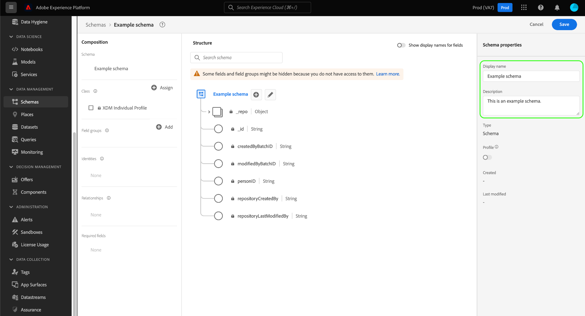

# 在UI中建立和編輯架構

本指南概述了如何在Adobe Experience PlatformUI中為您的組織建立、編輯和管理體驗資料模型(XDM)架構。

>[!IMPORTANT]
>
>XDM架構是極其可自定義的，因此建立架構時涉及的步驟可能因您希望架構捕獲的資料類型而異。 因此，本文檔僅涵蓋您可以與UI中的架構進行的基本交互，並排除了自定義類、架構欄位組、資料類型和欄位等相關步驟。
>
>有關架構建立過程的完整教程，請與 [架構建立教程](../../tutorials/create-schema-ui.md) 建立完整的示例架構並熟悉 [!DNL Schema Editor]。

## 先決條件

本指南要求對XDM系統有正確的瞭解。 請參閱 [XDM概述](../../home.md) 介紹XDM在Experience Platform生態系統中的作用， [架構組合基礎](../../schema/composition.md) 的子菜單。

## 建立新架構 {#create}

在 [!UICONTROL 架構] 工作區，選擇 **[!UICONTROL 建立架構]** 在右上角。 在顯示的下拉清單中，您可以選擇 **[!UICONTROL XDM個人配置檔案]** 和 **[!UICONTROL XDM體驗事件]** 作為架構的基類。 或者，可以選擇 **[!UICONTROL 瀏覽]** 從可用類的完整清單中進行選擇，或 [建立新的自定義類](./classes.md#create) 的雙曲餘切值。

選擇類後， [!DNL Schema Editor] 框中顯示，並在畫布中顯示架構的基本結構（由類提供）。 在此處，您可以使用右滑軌添加 **[!UICONTROL 顯示名稱]** 和 **[!UICONTROL 說明]** 的子菜單。

現在，可以開始通過 [添加架構欄位組](#add-field-groups)。

## 編輯現有架構 {#edit}

>[!NOTE]
>
>一旦保存了一個架構並將其用於資料接收，則只能對其進行附加更改。 查看 [模式演化規則](../../schema/composition.md#evolution) 的子菜單。

要編輯現有架構，請選擇 **[!UICONTROL 瀏覽]** 頁籤，然後選擇要編輯的架構的名稱。

>[!TIP]
>
>可以使用工作區的搜索和篩選功能幫助更輕鬆地查找架構。 請參閱上的指南 [探索XDM資源](../explore.md) 的子菜單。

選擇架構後， [!DNL Schema Editor] 顯示，其中在畫布中顯示架構的結構。 你現在可以 [添加欄位組](#add-field-groups) 到架構， [編輯欄位顯示名稱](#display-names)或 [編輯現有自定義域組](./field-groups.md#edit) 如果架構使用任何。

## 將欄位組添加到架構 {#add-field-groups}

>[!NOTE]
>
>本節介紹如何將現有欄位組添加到架構。 如果要建立新的自定義欄位組，請參閱上的指南 [建立和編輯欄位組](./field-groups.md#create) 的雙曲餘切值。

在中開啟架構後 [!DNL Schema Editor]，可以通過使用欄位組將欄位添加到架構。 要開始，請選擇 **[!UICONTROL 添加]** 旁邊 **[!UICONTROL 欄位組]** 左欄。

此時將顯示一個對話框，其中顯示可為架構選擇的欄位組清單。 由於欄位組只與一個類相容，因此將只列出與架構的選定類關聯的那些欄位組。 預設情況下，列出的欄位組會根據其在您組織中的使用情況進行排序。

如果您知道要添加的欄位的一般活動或業務區域，請在左滑軌中選擇一個或多個行業垂直類別，以過濾顯示的欄位組清單。

>[!NOTE]
>
>有關XDM中特定於行業的資料建模的最佳做法的詳細資訊，請參閱 [行業資料模型](../../schema/industries/overview.md)。

您還可以使用搜索欄幫助查找所需的欄位組。 名稱與查詢匹配的欄位組顯示在清單頂部。 下 **[!UICONTROL 標準欄位]**，將顯示包含描述所需資料屬性的欄位的欄位組。

選中要添加到架構的欄位組名稱旁邊的複選框。 您可以從清單中選擇多個欄位組，每個選定的欄位組出現在右滑軌中。

>[!TIP]
>
>對於任何列出的欄位組，可以懸停或聚焦於資訊表徵圖()查看欄位組捕獲的資料類型的簡要說明。 也可以選擇預覽表徵圖()查看欄位組提供的欄位的結構，然後再決定將其添加到架構中。

選擇欄位組後，選擇 **[!UICONTROL 添加欄位組]** 將其添加到架構。

的 [!DNL Schema Editor] 重新顯示，畫布中顯示了欄位組提供的欄位。

## 為即時客戶配置檔案啟用方案 {#profile}

[即時客戶概要資訊](../../../profile/home.md) 合併來自不同源的資料以構建每個客戶的完整視圖。 如果希望方案捕獲的資料參與此進程，則必須啟用該方案以供使用 [!DNL Profile]。

>[!IMPORTANT]
>
>為了為 [!DNL Profile]，它必須定義主標識欄位。 請參閱上的指南 [定義標識欄位](../fields/identity.md) 的子菜單。

要啟用架構，請從選擇左欄中架構的名稱開始，然後選擇 **[!UICONTROL 配置檔案]** 在右滑軌中切換。

出現一個跨距，警告您一旦啟用並保存了方案，就無法禁用它。 選擇 **[!UICONTROL 啟用]** 繼續。

畫布將用 [!UICONTROL 配置檔案] 啟用切換。

>[!IMPORTANT]
>
>由於尚未保存架構，因此如果您改變主意，讓架構參與即時客戶配置檔案，則此點不會返回：一旦保存了啟用的架構，就不能再禁用它。 選擇 **[!UICONTROL 配置檔案]** 再次切換以禁用架構。

要完成該流程，請選擇 **[!UICONTROL 保存]** 的子菜單。

此架構現在已啟用，可在即時客戶配置檔案中使用。 當平台基於此架構將資料插入資料集時，該資料將合併到合併的Profile資料中。

## 編輯架構欄位的顯示名稱 {#display-names}

一旦為架構分配了類並添加了欄位組，您就可以編輯該架構的任何欄位的顯示名稱，而不管這些欄位是由標準XDM資源還是由自定義XDM資源提供的。

>[!NOTE]
>
>請記住，屬於標準類或欄位組的欄位的顯示名稱只能在特定架構的上下文中編輯。 換句話說，更改一個方案中標準欄位的顯示名稱不會影響使用相同關聯類或欄位組的其他方案。
>
>一旦更改了架構欄位的顯示名稱，這些更改將立即反映在基於該架構的任何現有資料集中。

要編輯架構欄位的顯示名稱，請在畫布中選擇該欄位。 在右欄中，在 **[!UICONTROL 顯示名稱]**。

選擇 **[!UICONTROL 應用]** 在右欄中，畫布將更新以顯示欄位的新顯示名稱。 選擇 **[!UICONTROL 保存]** 將更改應用到架構。

## 更改架構的類 {#change-class}

在保存架構之前，可以在初始合成過程中的任何時刻更改架構的類。

>[!WARNING]
>
>為架構重新指派類應非常謹慎。 欄位組僅與某些類相容，因此更改該類將重置畫布和添加的任何欄位。

要重新指配類，請選擇 **[!UICONTROL 分配]** 畫布的左側。

此時將出現一個對話框，其中顯示所有可用類的清單，包括由您的組織定義的任何類(所有者為「」[!UICONTROL 客戶]&quot;)以及由Adobe定義的標準類。

從清單中選擇一個類，以在對話框的右側顯示其說明。 也可以選擇 **[!UICONTROL 預覽類結構]** 查看與類關聯的欄位和元資料。 選擇 **[!UICONTROL 分配類]** 繼續。

將開啟一個新對話框，要求您確認要分配新類。 選擇 **[!UICONTROL 分配]** 確認。

確認類更改後，將重置畫布，並丟失所有合成進度。

## 後續步驟

本文檔介紹了在平台UI中建立和編輯架構的基礎知識。 強烈建議您查看 [架構建立教程](../../tutorials/create-schema-ui.md) 用於在UI中構建完整架構的全面工作流，包括為唯一使用案例建立自定義欄位組和資料類型。

有關功能的詳細資訊 [!UICONTROL 架構] 工作區，請參閱 [[!UICONTROL 架構] 工作區概述](../overview.md)。

瞭解如何管理中的架構 [!DNL Schema Registry] API，請參見 [架構終結點指南](../../api/schemas.md)。
