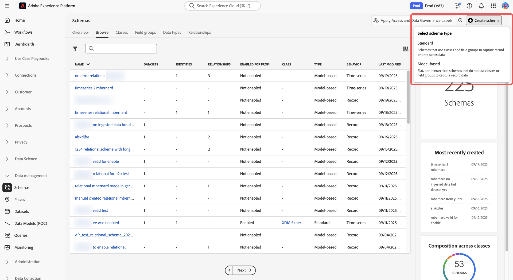
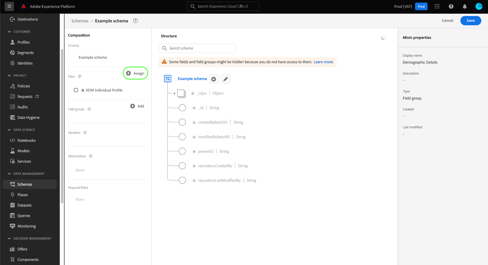

# 在UI中建立和編輯結構

本指南概述如何在Adobe Experience Platform UI中為貴組織建立、編輯及管理Experience Data Model(XDM)結構。

>[!IMPORTANT]
>
>XDM結構具有極強的可自訂性，因此建立結構時的步驟可能會因您要結構擷取的資料類型而異。 因此，本檔案僅涵蓋您可以在UI中與結構進行的基本互動，並排除了自訂類別、結構欄位群組、資料類型和欄位等相關步驟。
>
>如需架構建立程式的完整導覽，請遵循 [方案建立教學課程](../../tutorials/create-schema-ui.md) 若要建立完整的範例結構，並熟悉 [!DNL Schema Editor].

## 先決條件

本指南需要妥善了解XDM系統。 請參閱 [XDM概觀](../../home.md) 了解XDM在Experience Platform生態系統中的角色，以及 [綱要構成基本知識](../../schema/composition.md) 以概略了解結構的建構方式。

## 建立新結構 {#create}

在 [!UICONTROL 結構] 工作區，選取 **[!UICONTROL 建立結構]** 在右上角。 在隨即顯示的下拉式清單中，您可以選擇 **[!UICONTROL XDM個別設定檔]** 和 **[!UICONTROL XDM ExperienceEvent]** 作為架構的基類。 或者，您也可以選取 **[!UICONTROL 瀏覽]** 從可用類的完整清單中選擇，或 [建立新的自定義類](./classes.md#create) 。

選取類別後， [!DNL Schema Editor] 畫布中顯示，且架構的基礎結構（由類別提供）顯示。 從這裡，您可以使用右側邊欄來新增 **[!UICONTROL 顯示名稱]** 和 **[!UICONTROL 說明]** 的URL。

您現在可以開始建立結構，方法是 [添加架構欄位組](#add-field-groups).

## 編輯現有架構 {#edit}

>[!NOTE]
>
>儲存結構並用於資料擷取後，就只能對其進行加入式變更。 請參閱 [模式演化規則](../../schema/composition.md#evolution) 以取得更多資訊。

要編輯現有架構，請選擇 **[!UICONTROL 瀏覽]** 頁簽，然後選擇要編輯的架構的名稱。

>[!TIP]
>
>您可以使用工作區的搜尋和篩選功能來協助您更輕鬆找到結構。 請參閱 [探索XDM資源](../explore.md) 以取得更多資訊。

選取架構後， [!DNL Schema Editor] 畫布中顯示結構。 您現在可以 [新增欄位群組](#add-field-groups) 結構(或 [新增個別欄位](#add-individual-fields) ), [編輯欄位顯示名稱](#display-names)，或 [編輯現有的自訂欄位群組](./field-groups.md#edit) 如果架構採用任何。

## 將欄位群組新增至結構 {#add-field-groups}

>[!NOTE]
>
>本節說明如何將現有欄位群組新增至結構。 如果要建立新的自訂欄位群組，請參閱 [建立和編輯欄位組](./field-groups.md#create) 。

在中開啟架構後 [!DNL Schema Editor]，您可以使用欄位群組，將欄位新增至結構。 若要開始，請選取 **[!UICONTROL 新增]** 下一頁 **[!UICONTROL 欄位群組]** 在左側邊欄。

隨即出現對話框，其中顯示可為架構選擇的欄位組清單。 由於欄位組僅與一個類相容，因此將只列出與架構的所選類相關聯的那些欄位組。 依預設，列出的欄位群組會根據其在您組織中的使用人氣排序。

如果您知道要新增欄位的一般活動或業務區域，請在左側邊欄中選取一或多個垂直產業類別，以篩選顯示的欄位群組清單。

>[!NOTE]
>
>如需XDM中特定產業資料模型最佳實務的詳細資訊，請參閱 [產業資料模型](../../schema/industries/overview.md).

您也可以使用搜尋列來協助找出您想要的欄位群組。 名稱與查詢相符的欄位群組會顯示在清單頂端。 在 **[!UICONTROL 標準欄位]**，會顯示包含描述所需資料屬性之欄位的欄位群組。

選取您要新增至架構之欄位群組名稱旁的核取方塊。 您可以從清單中選取多個欄位群組，每個選取的欄位群組會顯示在右側邊欄中。

>[!TIP]
>
>對於任何列出的欄位群組，您可以暫留或聚焦在資訊圖示()以檢視欄位群組所擷取資料類型的簡短說明。 您也可以選取預覽圖示()來檢視欄位群組提供欄位的結構，然後再決定將其新增至架構。

選擇欄位組後，請選擇 **[!UICONTROL 新增欄位群組]** 將其新增至結構。

此 [!DNL Schema Editor] 以畫布中呈現的欄位群組提供欄位重新顯示。

將欄位群組新增至結構後，您可以選擇 [移除現有欄位](#remove-fields) 或 [新增自訂欄位](#add-fields) 根據您的需求，向這些群組傳送訊息。

### 移除從欄位群組新增的欄位 {#remove-fields}

將欄位群組新增至架構後，您可以移除任何您不需要的欄位。

>[!NOTE]
>
>從欄位組中刪除欄位只會影響正在處理的架構，而不會影響欄位組本身。 如果刪除一個架構中的欄位，則這些欄位仍可用於採用相同欄位群組的所有其他架構中。

在以下範例中，標準欄位群組 **[!UICONTROL 人口統計詳細資料]** 已新增至結構。 移除單一欄位，例如 `taxId`，選取畫布中的欄位，然後選取 **[!UICONTROL 移除]** 在右側邊欄。

如果要移除多個欄位，您可以整體管理欄位群組。 在畫布中選取屬於群組的欄位，然後選取 **[!UICONTROL 管理相關欄位]** 在右側邊欄。

將出現一個對話框，顯示有關欄位組的結構。 從這裡，您可以使用提供的核取方塊來選取或取消選取您需要的欄位。 滿足後，選擇 **[!UICONTROL 確認]**.

畫布會重新顯示，只有選取的欄位會顯示在架構結構中。

### 新增自訂欄位至欄位群組 {#add-fields}

將欄位群組新增至結構後，您可以定義該群組的其他欄位。 不過，在一個架構中，任何新增至欄位群組的欄位，也會顯示在採用相同欄位群組的所有其他架構中。

此外，如果將自訂欄位新增至標準欄位群組，該欄位群組將會轉換為自訂欄位群組，而原始標準欄位群組將不再可用。

如果要將自訂欄位新增至標準欄位群組，請參閱 [下文](#custom-fields-for-standard-groups) 以取得特定指示。 如果您要將欄位新增至自訂欄位群組，請參閱 [編輯自訂欄位群組](./field-groups.md) 在欄位群組UI指南中。

如果不想更改任何現有欄位組，可以 [建立新的自訂欄位群組](./field-groups.md#create) 來定義其他欄位。

## 將個別欄位新增至結構 {#add-individual-fields}

如果您不想針對特定使用案例新增整個欄位群組，架構編輯器可讓您直接將個別欄位新增至架構。 您可以 [從標準欄位群組新增個別欄位](#add-standard-fields) 或 [新增您自己的自訂欄位](#add-custom-fields) 。

>[!IMPORTANT]
>
>即使結構編輯器的功能允許您直接將個別欄位新增至結構，但這不會改變XDM結構中的所有欄位都必須由其類別或與該類別相容的欄位群組提供的事實。 正如以下各節所說明的，所有個別欄位在新增至架構時，仍會作為關鍵步驟與類別或欄位群組相關聯。

### 新增標準欄位 {#add-standard-fields}

您可以直接將標準欄位群組中的欄位新增至結構，而不需要預先知道其對應的欄位群組。 若要將標準欄位新增至結構，請選取加號(**+**)圖示（位於畫布中結構名稱旁）。 安 **[!UICONTROL 無標題欄位]** 預留位置會顯示在架構結構中，而右側邊欄會更新，以顯示用以設定欄位的控制項。

在 **[!UICONTROL 欄位名稱]**，開始輸入您要新增的欄位名稱。 系統會自動搜尋符合查詢的標準欄位，並將其列在 **[!UICONTROL 建議的標準欄位]**，包括其所屬的欄位群組。

雖然某些標準欄位具有相同名稱，但其結構可能會因其來源欄位群組而異。 如果在欄位組結構中的父對象內嵌套了標準欄位，則如果添加了子欄位，則父欄位也將包含在架構中。

選取預覽圖示()，以檢視其欄位群組的結構，並更清楚了解其可能巢狀化的方式。 若要將標準欄位新增至結構，請選取加號圖示()。

畫布會更新，顯示新增至架構的標準欄位，包括欄位群組結構內巢狀的任何父欄位。 欄位群組的名稱也列在 **[!UICONTROL 欄位群組]** 在左側邊欄。 如果要從相同欄位群組新增更多欄位，請選取 **[!UICONTROL 管理相關欄位]** 在右側邊欄。

### 新增自訂欄位 {#add-custom-fields}

與標準欄位的工作流程類似，您也可以將自己的自訂欄位直接新增至結構。

若要將欄位新增至架構的根層級，請選取加號(**+**)圖示（位於畫布中結構名稱旁）。 安 **[!UICONTROL 無標題欄位]** 預留位置會顯示在架構結構中，而右側邊欄會更新，以顯示用以設定欄位的控制項。

開始在要添加的欄位名稱中鍵入，系統會自動開始搜索匹配的標準欄位。 若要改為建立新自訂欄位，請選取附加在 **([!UICONTROL 新欄位])**.

為欄位提供顯示名稱和資料類型後，下一步是將欄位指派給上層XDM資源。 如果您的架構使用自訂類別，您可以選擇 [將欄位新增至指派的類別](#add-to-class) 或 [欄位群組](#add-to-field-group) 。 但是，如果您的架構使用標準類，則只能將自訂欄位指派給欄位群組。

#### 將欄位指派給自訂欄位群組 {#add-to-field-group}

>[!NOTE]
>
>本節僅說明如何將欄位指派給自訂欄位群組。 如果您想要改用新自訂欄位來擴充標準欄位群組，請參閱 [將自訂欄位新增至標準欄位群組](#custom-fields-for-standard-groups).

在 **[!UICONTROL 指派給]**，選取 **[!UICONTROL 欄位組]**. 如果您的架構使用標準類，則此為唯一可用的選項，預設情況下為選中。

接下來，必須為要關聯的新欄位選擇一個欄位組。 開始在提供的文字輸入中輸入欄位群組的名稱。 如果您有任何符合輸入的現有自訂欄位群組，它們會出現在下拉式清單中。 或者，您也可以輸入唯一名稱，以改為建立新欄位群組。

>[!WARNING]
>
>如果您選取現有的自訂欄位群組，則使用該欄位群組的任何其他結構也會在您儲存變更後繼承新新增的欄位。 因此，如果要此傳播類型，則僅選擇現有欄位組。 否則，您應該選擇建立新的自訂欄位群組。

從清單中選取欄位群組後，請選取 **[!UICONTROL 套用]**.

新欄位會新增至畫布，並以您的 [租用戶ID](../../api/getting-started.md#know-your-tenant_id) 以避免與標準XDM欄位衝突。 您與新欄位關聯的欄位群組也會顯示在 **[!UICONTROL 欄位群組]** 在左側邊欄。

>[!NOTE]
>
>依預設，所選自訂欄位群組提供的其餘欄位會從架構中移除。 如果要將其中一些欄位添加到架構，請選擇屬於該組的欄位，然後選擇 **[!UICONTROL 管理相關欄位]** 在右側邊欄。

#### 將欄位指派給自訂類別 {#add-to-class}

在 **[!UICONTROL 指派給]**，選取 **[!UICONTROL 類別]**. 下面的輸入欄位將替換為當前架構的自定義類的名稱，表示將為該類分配新欄位。

![此 [!UICONTROL 類別] 選項。](../../images/ui/resources/schemas/assign-field-to-class.png)

視需要繼續設定欄位並選取 **[!UICONTROL 套用]** 完成時。

![[!UICONTROL 套用] 正在為新欄位選擇。](../../images/ui/resources/schemas/assign-field-to-class-apply.png)

新欄位會新增至畫布，並以您的 [租用戶ID](../../api/getting-started.md#know-your-tenant_id) 以避免與標準XDM欄位衝突。 在左側欄中選取類別名稱會顯示作為類別結構一部分的新欄位。

### 將自訂欄位新增至標準欄位群組的結構 {#custom-fields-for-standard-groups}

如果您正在處理的結構具有標準欄位組提供的對象類型欄位，則您可以將自己的自定義欄位添加到該標準對象。

>[!WARNING]
>
>在一個方案中添加到欄位組的任何欄位，也將出現在採用相同欄位組的所有其他方案中。 此外，如果將自訂欄位新增至標準欄位群組，該欄位群組將會轉換為自訂欄位群組，而原始標準欄位群組將不再可用。
>
>如果您參與此功能的測試版，您會收到一個對話方塊，通知您先前已自訂的標準欄位群組。 選取 **[!UICONTROL 確認]**，則列出的資源會轉換為自訂欄位群組。
>
>

若要開始，請選取加號(**+**)圖示（位於標準欄位群組所提供物件的根目錄旁）。

系統會顯示警告訊息，提示您確認是否要轉換標準欄位群組。 選擇 **[!UICONTROL 繼續建立欄位組]** 繼續。

畫布會重新顯示，其中包含新欄位的未命名預留位置。 請注意，標準欄位組的名稱已附加「([!UICONTROL 延伸])」，指出其已從原始版本修改。 從此處，使用右側邊欄中的控制項來定義欄位的屬性。

套用變更後，新欄位會顯示在標準物件的租用戶ID命名空間底下。 此巢狀命名空間可防止欄位群組本身內的欄位名稱衝突，以避免在使用相同欄位群組的其他結構中中斷變更。

## 啟用即時客戶個人檔案的結構 {#profile}

>[!CONTEXTUALHELP]
>id="platform_schemas_enableforprofile"
>title="為設定檔啟用結構"
>abstract="為「設定檔」啟用結構時，從此結構建立的任何資料集都會參與「即時客戶設定檔」，即時客戶設定檔會合併不同來源的資料，以建構每個客戶的完整檢視。 一旦使用結構將資料內嵌至設定檔，便無法停用。 如需詳細資訊，請參閱文件。"

[即時客戶個人檔案](../../../profile/home.md) 合併來自不同來源的資料，以建構每個客戶的完整檢視。 如果希望架構捕獲的資料參與此過程，則必須啟用該架構以用於 [!DNL Profile].

>[!IMPORTANT]
>
>為 [!DNL Profile]，則必須定義主要身分欄位。 請參閱 [定義身分欄位](../fields/identity.md) 以取得更多資訊。

若要啟用架構，請從左側邊欄中選取架構的名稱開始，然後選取 **[!UICONTROL 設定檔]** 在右側邊欄中切換。

畫面會顯示彈出視窗，警告一旦啟用並儲存架構後，就無法停用。 選擇 **[!UICONTROL 啟用]** 繼續。

畫布會以 [!UICONTROL 設定檔] 切換為啟用。

>[!IMPORTANT]
>
>由於尚未儲存結構，如果您改變心意讓結構參與即時客戶設定檔，則此為無法傳回的點：儲存已啟用的架構後，就無法再停用該架構。 選取 **[!UICONTROL 設定檔]** 再次切換以停用架構。

要完成該過程，請選擇 **[!UICONTROL 儲存]** 以儲存結構。

此結構現已啟用，可在即時客戶設定檔中使用。 Platform根據此結構將資料內嵌至資料集時，該資料將會併入您合併的設定檔資料中。

## 編輯架構欄位的顯示名稱 {#display-names}

在您指派類別並新增欄位群組至架構後，無論標準或自訂XDM資源是否已提供這些欄位，您都可以編輯任何架構欄位的顯示名稱。

>[!NOTE]
>
>請記住，屬於標準類或欄位組的欄位的顯示名稱只能在特定架構的上下文中編輯。 換言之，更改一個方案中標準欄位的顯示名稱不會影響採用相同關聯類別或欄位群組的其他方案。
>
>變更結構欄位的顯示名稱后，這些變更會立即反映在根據該結構的任何現有資料集中。

若要編輯架構欄位的顯示名稱，請在畫布中選取欄位。 在右側邊欄中，於 **[!UICONTROL 顯示名稱]**.

選擇 **[!UICONTROL 套用]** 在右側邊欄中，畫布會更新以顯示欄位的新顯示名稱。 選擇 **[!UICONTROL 儲存]** 將更改應用到架構。

## 更改架構的類 {#change-class}

您可以在儲存架構之前的初始合成程式期間的任何時間點變更架構的類別。

>[!WARNING]
>
>為架構重新指派類別時應格外小心。 欄位組僅與某些類相容，因此更改類將重置畫布和您添加的任何欄位。

要重新分配類，請選擇 **[!UICONTROL 指派]** 在畫布的左側。

此時將出現一個對話框，其中顯示所有可用類的清單，包括您的組織定義的任何類(所有者為「[!UICONTROL 客戶]「)以及由Adobe定義的標準類。

從清單中選擇一個類，以在對話框的右側顯示其說明。 您也可以選取 **[!UICONTROL 預覽類結構]** 查看與類關聯的欄位和元資料。 選擇 **[!UICONTROL 分配類]** 繼續。

將開啟一個新對話框，要求您確認要指派新類。 選擇 **[!UICONTROL 指派]** 確認。

確認類別變更後，畫布會重設，所有合成進度都會遺失。

## 後續步驟

本檔案說明在Platform UI中建立和編輯結構描述的基本知識。 強烈建議您檢閱 [方案建立教學課程](../../tutorials/create-schema-ui.md) 以取得在UI中建立完整結構的完整工作流程，包括針對不重複使用案例建立自訂欄位群組和資料類型。

如需功能的詳細資訊，請參閱 [!UICONTROL 結構] 工作區，請參閱 [[!UICONTROL 結構] 工作區概述](../overview.md).

若要了解如何管理 [!DNL Schema Registry] API，請參閱 [schemas endpoint指南](../../api/schemas.md).
